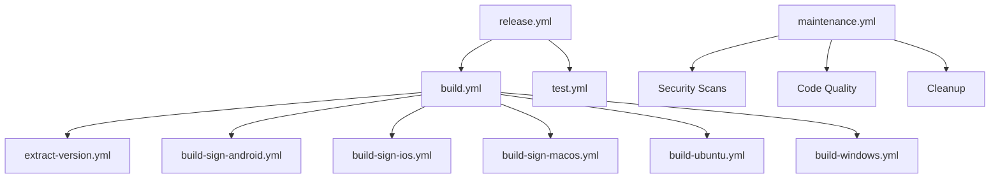

# GitHub Actions Workflows

This directory contains the GitHub Actions workflows for the Tauri Template project. The workflows are organized with `build.yml` as the core orchestrator.

## Workflow Organization

### 🏗️ Core Workflows

#### `build.yml` - Main Build Orchestrator
- **Purpose**: Central coordinator for all platform builds
- **Triggers**: Push to main, Pull requests, Manual dispatch
- **Features**:
  - Extracts version using reusable workflow
  - Builds all platforms in parallel
  - Provides comprehensive build summary
  - Inherits secrets for signing and publishing

#### `extract-version.yml` - Version Extraction
- **Purpose**: Reusable workflow to extract version from package.json
- **Type**: Reusable workflow (workflow_call)
- **Outputs**: `version` - The extracted version string

### 🧪 Testing Workflows

#### `test.yml` - Comprehensive Testing
- **Purpose**: Run all tests (frontend, Rust, security)
- **Triggers**: Push to main/develop, Pull requests, Manual dispatch
- **Features**:
  - Frontend tests and linting
  - Rust tests, clippy, and formatting
  - Security audits for both npm and Cargo
  - Test result summary

### 🚀 Release Workflows

#### `release.yml` - Release Management
- **Purpose**: Create releases with all platform builds
- **Triggers**: Tag push (v*), Manual dispatch
- **Features**:
  - Runs tests before building
  - Uses build.yml for all platform builds
  - Creates GitHub release with auto-generated notes
  - Supports pre-releases

### 🔧 Maintenance Workflows

#### `maintenance.yml` - Automated Maintenance
- **Purpose**: Regular maintenance tasks
- **Triggers**: Weekly schedule (Sundays 2 AM UTC), Manual dispatch
- **Features**:
  - Dependency update checks
  - Security vulnerability scans
  - Code quality analysis
  - Cleanup of old workflow runs

### 📱 Platform-Specific Workflows

These workflows are called by `build.yml` and should not be triggered directly:

- `build-sign-android.yml` - Android APK builds
- `build-sign-ios.yml` - iOS IPA builds  
- `build-sign-macos.yml` - macOS DMG builds
- `build-ubuntu.yml` - Ubuntu AppImage/DEB builds
- `build-windows.yml` - Windows MSI/EXE builds

## Workflow Dependencies



## Environment Variables

All workflows use consistent environment variables:

- `APP_NAME`: "tauri-template"
- `APP_PATH`: "./"

## Secrets Required

The following secrets should be configured in the repository:

### For Android builds:
- `ANDROID_KEYSTORE_BASE64`
- `ANDROID_KEYSTORE_PASSWORD`
- `ANDROID_KEY_ALIAS`
- `ANDROID_KEY_PASSWORD`

### For iOS builds:
- `IOS_CERTIFICATE_BASE64`
- `IOS_CERTIFICATE_PASSWORD`
- `IOS_PROVISIONING_PROFILE_BASE64`

### For macOS builds:
- `MACOS_CERTIFICATE_BASE64`
- `MACOS_CERTIFICATE_PASSWORD`
- `MACOS_NOTARIZATION_APPLE_ID`
- `MACOS_NOTARIZATION_TEAM_ID`
- `MACOS_NOTARIZATION_PASSWORD`

## Usage Examples

### Manual Build
```bash
# Trigger a manual build of all platforms
gh workflow run build.yml
```

### Manual Release
```bash
# Create a release with version v1.0.0
gh workflow run release.yml --field version=v1.0.0 --field prerelease=false
```

### Run Tests
```bash
# Run all tests
gh workflow run test.yml
```

### Manual Maintenance
```bash
# Run maintenance tasks
gh workflow run maintenance.yml
```

## Best Practices

1. **Always use the core orchestrator**: Use `build.yml` for building, not individual platform workflows
2. **Test before release**: The release workflow automatically runs tests
3. **Use reusable workflows**: `extract-version.yml` is used by multiple workflows
4. **Monitor summaries**: Each workflow provides detailed summaries in the GitHub Actions UI
5. **Keep secrets secure**: Never hardcode secrets in workflow files

## Troubleshooting

### Common Issues

1. **Version extraction fails**: Check that `package.json` exists and has a valid version field
2. **Platform builds fail**: Check that all required secrets are configured
3. **Tests fail**: Review the test summary for specific failure details
4. **Release creation fails**: Ensure you have write permissions to the repository

### Debugging

1. Enable debug logging by setting `ACTIONS_STEP_DEBUG=true` in repository secrets
2. Check workflow summaries for detailed status information
3. Review individual job logs for specific error messages

## Contributing

When adding new workflows:

1. Follow the established naming convention
2. Add appropriate triggers and environment variables
3. Include comprehensive error handling
4. Add summaries for better visibility
5. Update this README with new workflow documentation
