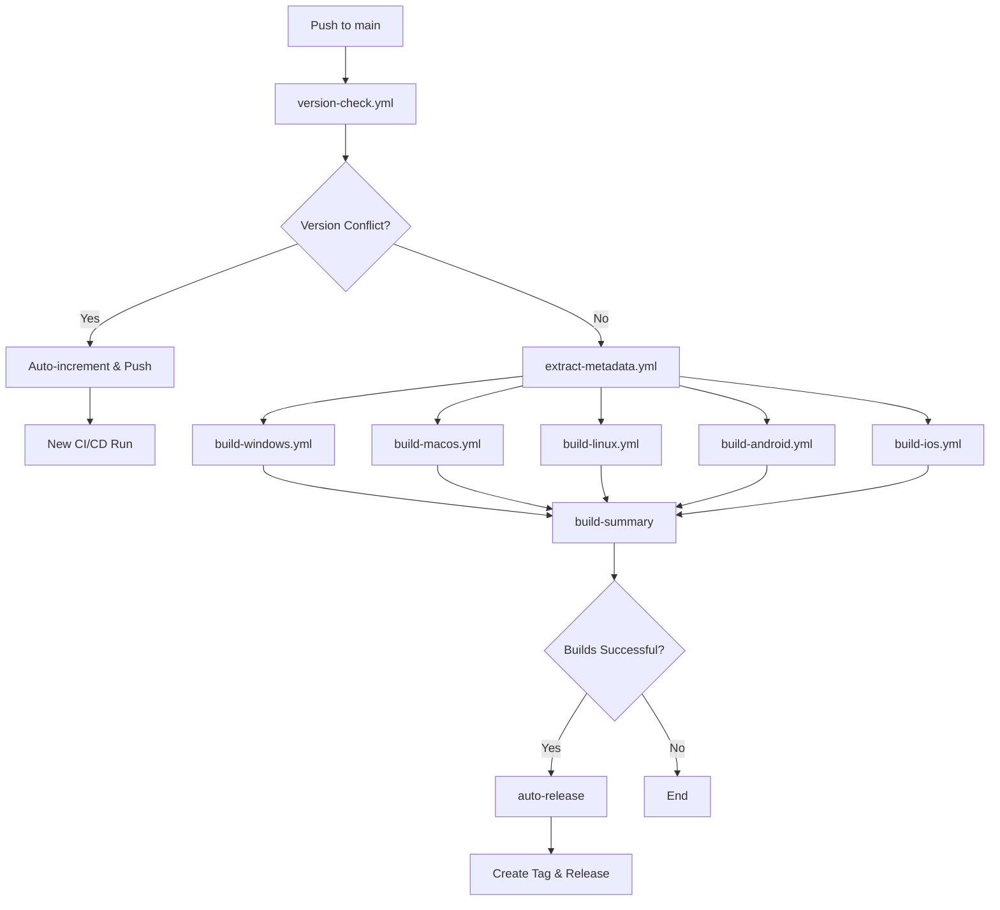

# GitHub Actions Workflows

This directory contains the CI/CD workflows for the Tauri template project. The workflows are designed with automatic version management and comprehensive cross-platform building.

## 🏗️ Workflow Architecture

### Core Workflows

1. **[main.yml](./main.yml)** - Main CI/CD Pipeline
   - Orchestrates the entire build process
   - Includes automatic version checking and increment
   - Builds for all platforms (Windows, macOS, Linux, Android, iOS)

2. **[release.yml](./release.yml)** - Release Creation
   - Creates GitHub releases with artifacts
   - Handles release notes and asset uploads

### Utility Workflows

3. **[version-check.yml](./version-check.yml)** - Version Management
   - Compares current version with latest release
   - Auto-increments version if conflict detected
   - Updates both `package.json` and `src-tauri/Cargo.toml`

4. **[extract-metadata.yml](./extract-metadata.yml)** - Metadata Extraction
   - Extracts app name and version from `package.json`
   - Provides reusable metadata for other workflows

### Platform-Specific Build Workflows

5. **[build-windows.yml](./build-windows.yml)** - Windows builds (.msi, .exe)
6. **[build-macos.yml](./build-macos.yml)** - macOS builds (.dmg, .app.tar.gz)
7. **[build-linux.yml](./build-linux.yml)** - Linux builds (.deb, .rpm, .AppImage)
8. **[build-android.yml](./build-android.yml)** - Android builds (.apk, .aab)
9. **[build-ios.yml](./build-ios.yml)** - iOS builds (.ipa)

## 🔄 Automatic Version Management

### How It Works

1. **Version Check**: When code is pushed to `main`, the workflow compares the current `package.json` version with the latest GitHub release.

2. **Auto-Increment**: If versions match (indicating a duplicate), the workflow:
   - Increments the patch version (e.g., `1.0.0` → `1.0.1`)
   - Updates `package.json` and `src-tauri/Cargo.toml`
   - Commits changes with `[skip ci]` message
   - Pushes to repository, triggering a new CI/CD run

3. **Build Process**: If version is unique, proceeds with normal CI/CD pipeline.

### Version Format

- Uses semantic versioning: `MAJOR.MINOR.PATCH`
- Auto-increment only affects PATCH version
- Manual version changes (MAJOR/MINOR) are respected

### Triggering Conditions

| Event | Version Check | Build Process | Auto-Release |
|-------|---------------|---------------|-------------|
| Push to `main` | ✅ Yes | Only if version is unique | ✅ Yes (if builds succeed) |
| Pull Request | ❌ No | ✅ Yes (always) | ❌ No |
| Manual Dispatch | 🔧 Optional | ✅ Yes | ❌ No |

## 🚀 Usage

### Automatic Builds & Releases

Simply push to `main` branch:
```bash
git push origin main
```

The workflow will:
1. Check if your version conflicts with existing releases
2. Auto-increment if needed, or proceed with build
3. Build for all platforms
4. **Automatically create a GitHub release with tag** (if builds succeed)
5. Generate build summary with release links

### Manual Builds

Use GitHub Actions UI to trigger manually:
1. Go to **Actions** tab
2. Select **CI/CD Pipeline**
3. Click **Run workflow**
4. Optionally skip version check

### Manual Releases

**Automatic releases** are created for successful main branch builds.

For manual releases:
1. Go to **Actions** tab
2. Select **Release** workflow
3. Click **Run workflow**
4. Specify version tag (e.g., `v1.0.0`)

**Note:** Auto-releases only occur for pushes to `main` branch with successful builds.

## 📋 Build Outputs

### Artifact Naming Convention

All artifacts follow the pattern:
```
{app-name}-{version}-{platform}-{architecture}.{extension}
```

Examples:
- `tauri-template-1.0.0-windows-x64.msi`
- `tauri-template-1.0.0-macos-universal.dmg`
- `tauri-template-1.0.0-linux-x64.AppImage`
- `tauri-template-1.0.0-android-universal.apk`
- `tauri-template-1.0.0-ios-universal.ipa`

### Platform Support

| Platform | Architectures | Formats |
|----------|---------------|---------|
| Windows | x64, x86, ARM64 | `.msi`, `.exe` |
| macOS | Universal, Intel, Apple Silicon | `.dmg`, `.app.tar.gz` |
| Linux | x64, ARM64 | `.deb`, `.rpm`, `.AppImage` |
| Android | Universal, ARM64, ARMv7, x86_64 | `.apk`, `.aab` |
| iOS | Universal | `.ipa` |

## 🔧 Configuration

### Required Secrets

The workflows use **explicit secret passing** for better security and clarity.

For detailed setup instructions, see [SECRETS_SETUP.md](../SECRETS_SETUP.md).

#### Platform-Specific Secrets:

**Android Signing:**
- `ANDROID_KEY_BASE64` - Base64 encoded keystore file
- `ANDROID_KEY_ALIAS` - Key alias
- `ANDROID_KEY_PASSWORD` - Key password

**Apple/macOS Signing:**
- `APPLE_CERTIFICATE` - Base64 encoded certificate
- `APPLE_CERTIFICATE_PASSWORD` - Certificate password
- `APPLE_ID` - Apple ID email
- `APPLE_APP_SPECIFIC_PASSWORD` - App-specific password
- `APPLE_TEAM_ID` - Developer team ID
- `KEYCHAIN_PASSWORD` - Keychain password

**iOS Specific:**
- `IOS_CERTIFICATE` - Base64 encoded iOS certificate
- `IOS_CERTIFICATE_PASSWORD` - Certificate password
- `IOS_PROVISIONING_PROFILE` - Base64 encoded provisioning profile
- `IOS_BUNDLE_ID` - App bundle identifier
- `APP_STORE_CONNECT_API_KEY` - App Store Connect API key (optional)
- `APP_STORE_CONNECT_API_KEY_ID` - API key ID (optional)
- `APP_STORE_CONNECT_ISSUER_ID` - Issuer ID (optional)

**Windows Signing (Optional):**
- `WINDOWS_CERTIFICATE` - Base64 encoded certificate
- `WINDOWS_CERTIFICATE_PASSWORD` - Certificate password

### Customization

#### Skip Version Check
```yaml
# In workflow_dispatch input
skip-version-check: true
```

#### Modify Build Platforms
Edit `main.yml` to include/exclude platform builds:
```yaml
# Comment out unwanted platforms
# build-ios:
#   name: 'Build iOS'
#   ...
```

#### Change Version Increment Logic
Modify `version-check.yml` to change increment behavior:
```bash
# Current: increments patch (1.0.0 → 1.0.1)
NEW_PATCH=$((PATCH + 1))

# Alternative: increment minor (1.0.0 → 1.1.0)
NEW_MINOR=$((MINOR + 1))
NEW_VERSION="${MAJOR}.${NEW_MINOR}.0"
```

## 🛠️ Troubleshooting

### Common Issues

1. **Version Increment Loop**
   - Check for `[skip ci]` in commit messages
   - Verify git configuration in workflow

2. **Build Failures**
   - Check individual platform workflow logs
   - Verify dependencies and signing certificates

3. **Missing Artifacts**
   - Ensure build completed successfully
   - Check artifact retention settings

### Debug Mode

Enable debug logging by setting repository secret:
```
ACTIONS_STEP_DEBUG = true
```

## 📚 Related Documentation

- [Secrets Configuration](../SECRETS.md)
- [Tauri Documentation](https://tauri.app/v1/guides/)
- [GitHub Actions Documentation](https://docs.github.com/en/actions)

## 🔄 Workflow Dependencies



This architecture ensures reliable, automated builds with intelligent version management and comprehensive platform support.
